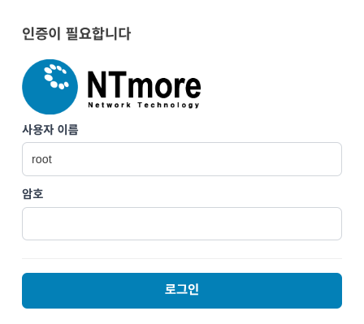
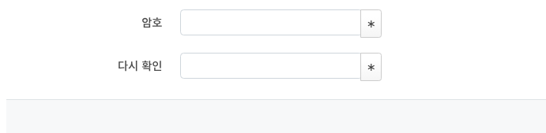

관리자 UI 접속
=============

UI 접속
------------------------------------
1. 랜 케이블을 이용하여 모뎀과 PC를 연결합니다.
2. 아래의 URL을 웹 브라우저를 사용하여 접속합니다.
3. 아래 그림처럼 로그인 페이지가 나오면 초기 설정되어 있는 사용자 이름과 비밀번호를 입력하세요.

- http://192.168.15.1

기본 로그인 및 비밀번호 변경
------------------------------------

