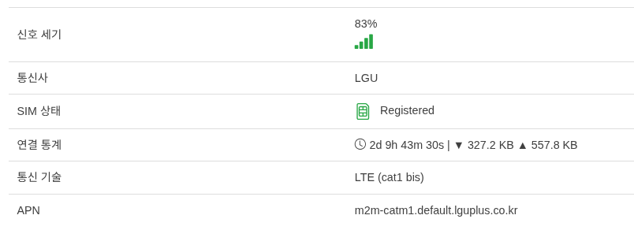
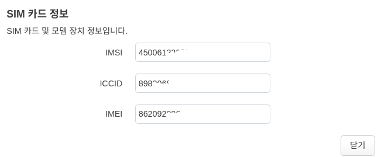
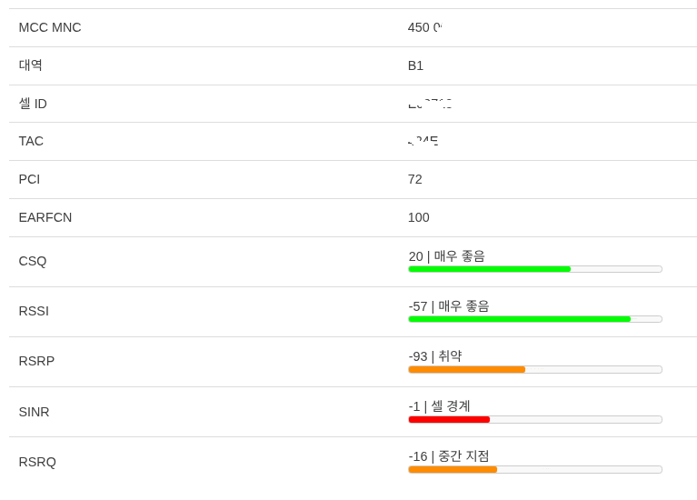

통신사 망 연동 설정
=============

SIM 카드 장착 및 상태 확인
------------------------------------

**모뎀->모뎀 정보** 화면에서 SIM 상태를 확인 할 수 있습니다.

**SIM 상태** 가 올바르게 *Registered* 상태인지 확인하십시요.

SIM에 대한 자세한 정보는 해당 메뉴에서 USIM 모양의 아이콘을 클릭 하면 표시됩니다.

APN 프로필 설정
------------------------------------

**모뎀->모뎀 정보->설정** 화면에서 사용자가 직접 APN 을 설정 할 수 있습니다.

기본값은 NULL (자동 할당) 이며, 이에대한 표시는 **모뎀->모뎀 정보** 화면에 표시 됩니다.

**APN** LTE망에서 받은 APN 값 입니다. NULL 로 설정할 경우 **|** 가 표시되며, 사용자가 설정한 값 NULL이 표시 됩니다.

신호 세기 모니터링
------------------------------------

신호 세기 모니터링은 **모뎀->모뎀 정보** 하단에 연관된 값들을 보여줍니다.