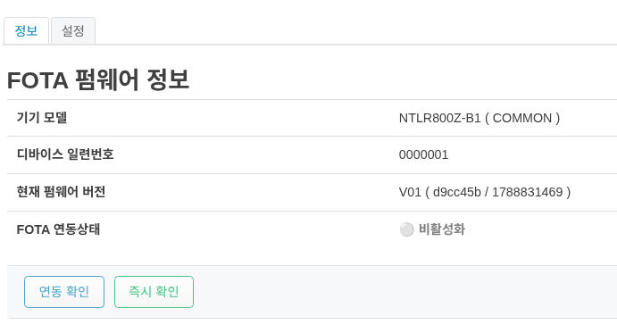
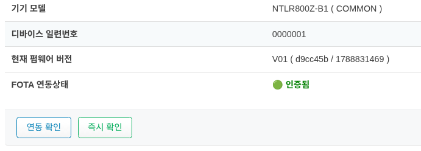
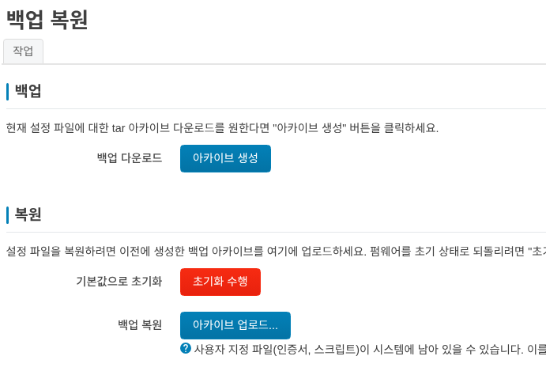

장치 관리 및 식별
=============

단말 정보 확인
------------------------------------

단말의 정보는 **상태->개요** 에 표시됩니다.

.. image:: ../main_menu/images/overview-01.png
    :width: 100%

NTLR800Z-B1모델은 디바이스의 고유 번호인 **디바이스 일련번호** 가 기본이 되고 있습니다.

펌웨어 업데이트 방법
------------------------------------
펌웨어 업데이트는 자사의 FOTA 서버를 통해서만 진행이 가능합니다.

기본 화면은 아래와 같습니다.

1. FOTA 연동상태를 확인하여야 하며 **비활성화** 인 경우는 **시스템->시스템 업데이트->설정** 에서 **FOTA 기능 활성화** 를 선택하십시요.
2. **FOTA 기능 활성화** 를 선택한 후에는 **연동 확인**과 **즉시 확인** 버튼이 활성화 됩니다.
3. **연동 확인** 혹은 **즉시 확인* 버튼을 누르면 아래처럼 활성화가 됩니다.

4. 만약에 자동으로 업데이트를 원하면 **시스템->시스템 업데이트->설정** 에서 **자동 업데이트 설정** 을 활성화 하시면 됩니다.
5. 서버에서 업데이트 내용이 있으면, 업데이트가 진행 됩니다.

.. danger:: 
    업데이트가 진행중에는 전원을 끄거나 USIM을 제거하는 동작을 해서는 절대 안됩니다.

공장 초기화
------------------------------------

공장 초기화는 두가지 방법을 사용할수 있습니다.

**관리 UI 접속이 가능할때**

1. **시스템->Backup / Restore Config** 에서 **복원** 기본값으로 초기화 ``초기화 수행`` 을 실행 합니다.
2. 초기 설정 화면 (http://192.168.15.1) 으로 접속하여 로그인 합니다.

**관리 UI 접속이 가능하지 않은 경우**

1. 전원을 연결하고 디바이스를 뒤집어 봅니다.
2. reset 이라고 써있는 부분을 약 5초간 누르면, LTE LED가 점등을 시작하며, 빠르게 점등이 가속되면 누르고 있는것을 떼면 됩니다.
3. 약 5분정도 지난후에 초기 설정 화면(http://192.168.15.1) 으로 접속하여 로그인 합니다.

.. danger:: 
    초기화가 진행중에 일부러 전원을 자주 끄는 행동을 해서는 안됩니다.