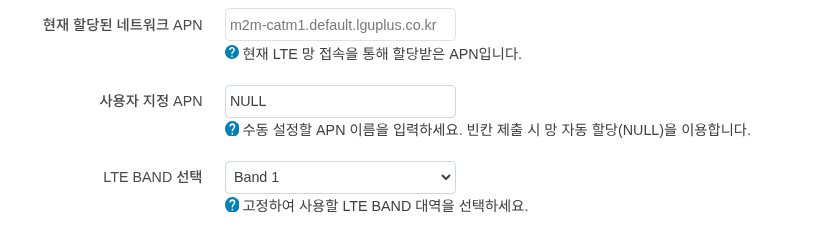
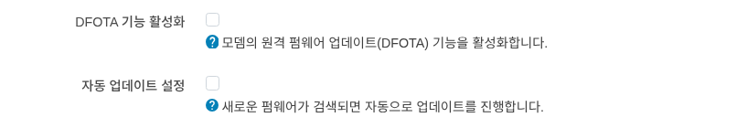
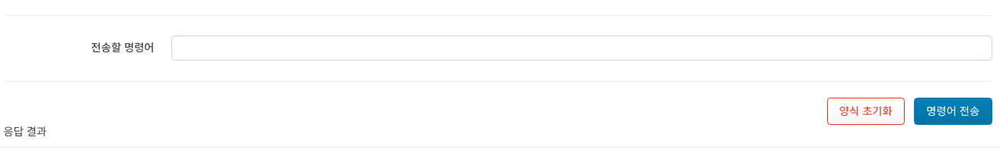

모뎀
=============

모뎀 정보
''''''''''''''''''''''''''''
상세정보
------------------------------------
.. image:: ./images/modem-00.png
    :width: 80%

**신호 세기** : 신호 세기를 안테나와 %와 함께 표시 됩니다.

**통신사** : 연결된 통신사 이름을 표시 합니다.

**SIM 상태** : SIM 카드의 상태를 표시 합니다.

**연결 통계** : 연결된 네트워크의 통계 정보를 표시 합니다.

**통신 기술** : 사용 중인 통신 기술을 표시 합니다.

**APN** : 사용 중인 APN을 표시 합니다. 

설정
------------------------------------

**현재 할당된 네트워크 APN** : 현재 LTE 망 접속을 통해 할당받은 APN 정보를 표시 합니다.

**사용자 지정 APN** : 사용자가 직접 APN을 입력하여 연결할 수 있습니다. (**NULL** 입력시 망에서 부여받습니다.)

**LTE BAND 선택** : 디바이스가 사용가능한 BAND를 선택할 수 있습니다.

.. important:: 
    통신사에 따라 LTE BAND 선택이 제한될 수 있습니다.

DFota(Delta Firmware Over-The-Air)
------------------------------------
모뎀(Quectel)의 FOTA 펌웨어 업데이트 기능을 설정합니다.

**DFOTA 기능 활성화** : DFOTA 기능을 활성화/비활성화 할 수 있습니다.

**자동 업데이트 설정** : 새로운 펌웨어가 있는 경우 자동으로 업데이트를 진행합니다.

AT 명령어
''''''''''''''''''''''''''''

**AT 명령어 입력** : UI에서 AT 명령어를 입력하여, 모뎀과 통신할 수 있습니다.

하단에 응답 결과 에 결과가 표시 됩니다.

모뎀 리셋
''''''''''''''''''''''''''''

Quectel 모뎀을 리셋합니다.

.. important:: 
    라우터 디바이스는 재시작 하지 않습니다.