네트워크
=============

''''''''''''''''''''''''''''

인터페이스
------------------------------------
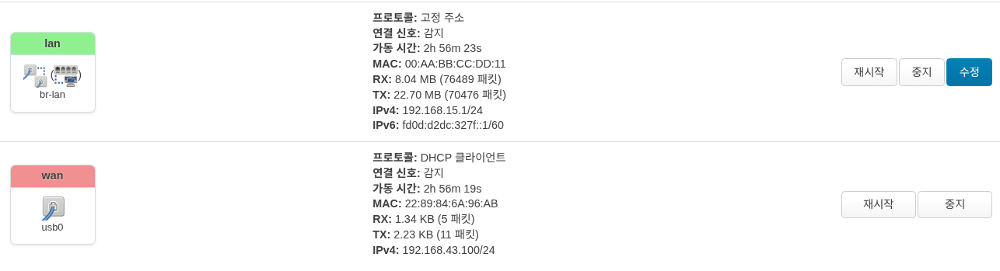

물리적 인터페이스의 현황을 보여줍니다. 간단한 사용량을 볼수 있으며, :guilabel:`수정` 버튼을 눌러서 활성화/비활성화, 기본 게이트웨이 주소 변경 및 설정을 할수 있습니다.

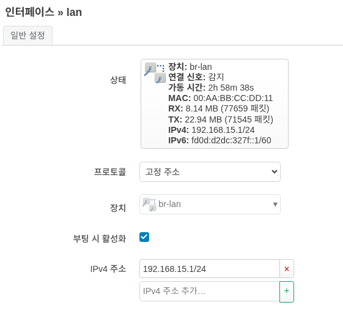

.. caution:: 
    기본 게이트웨이 주소가 올바르지 못하면, UI에 접속이 불가할수 있으며, 공장 초기화(factory reset)을 해야 할수 있습니다.

장치
------------------------------------
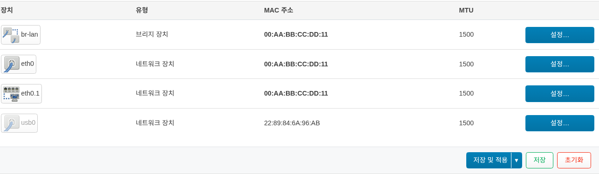
논리적인 인터페이스의 현황을 보여줍니다. :guilabel:`설정` 버튼을 눌러서 MTU 값을 수정할 수 있습니다.

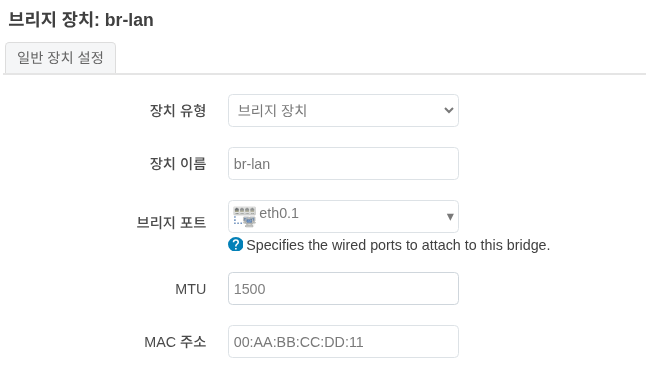

DHCP
''''''''''''''''''''''''''''
현재 접속되어 있거나 접속 되었던 DHCP 호스트 들의 정보를 표시 해줍니다. 설정을 통해서 기본 게이트웨이 주소를 변경할수 있으며, DHCP 범위도 변경이 가능합니다.

할당
------------------------------------
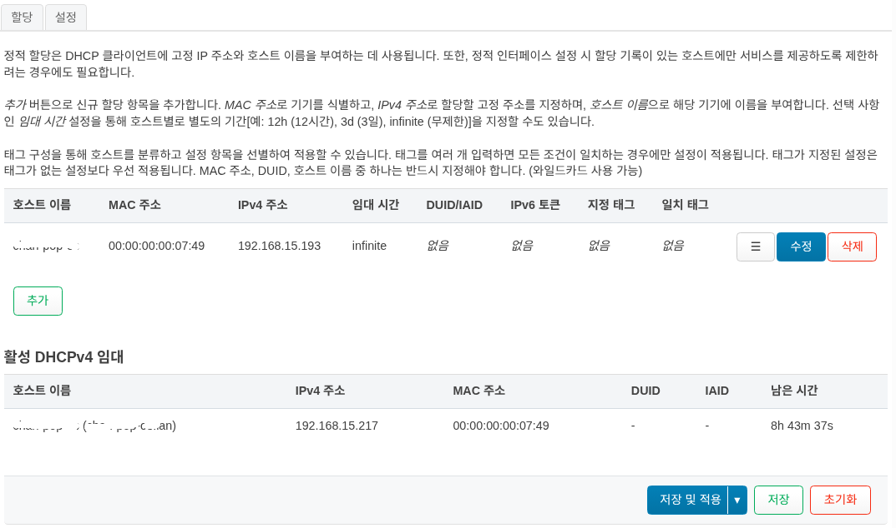

:guilabel:`추가` 혹은 :guilabel:`수정` 버튼을 누르면 아래 화면 처럼 DHCP 등록을 할 수 있는 화면이 표시 됩니다.

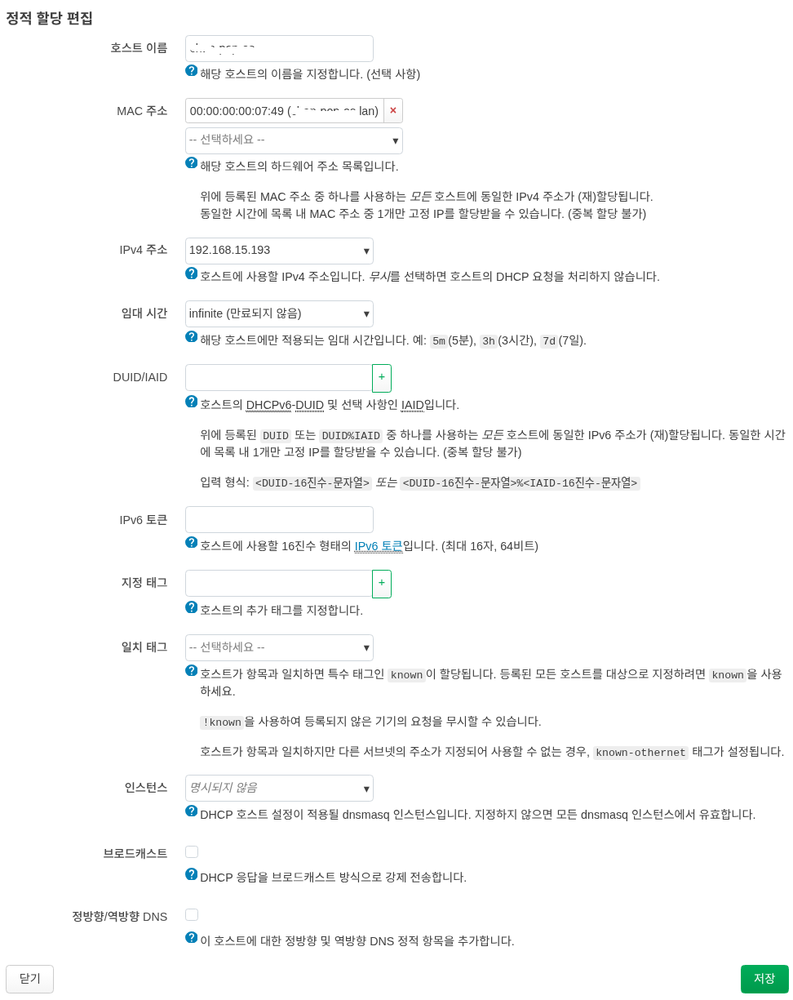

설정
------------------------------------
기본 게이트웨이 주소를 변경할수 있으며, DHCP 범위도 변경이 가능합니다.

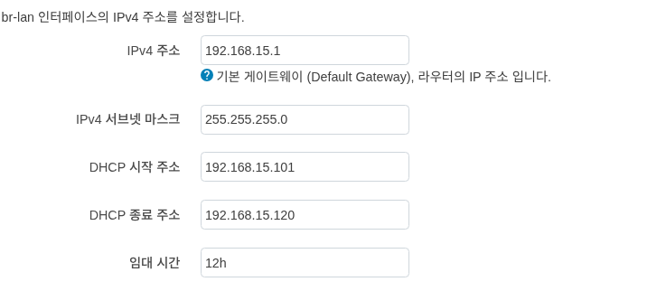

.. caution:: 
    기본 게이트웨이 주소가 올바르지 못하면, UI에 접속이 불가할수 있으며, 공장 초기화(factory reset)을 해야 할수 있습니다.

방화벽
''''''''''''''''''''''''''''
.. important:: 
    CGNAT(Carrier-Grade NAT) 구간에서의 사용은, 동작에 물리적인 제한이 있습니다. 예) inbound 처리
.. caution:: 
    방화벽 설정이 올바르지 못하면, UI에 접속이 불가할 수 있으며, 공장 초기화(factory reset)을 해야 할수 있습니다.

일반 설정
------------------------------------
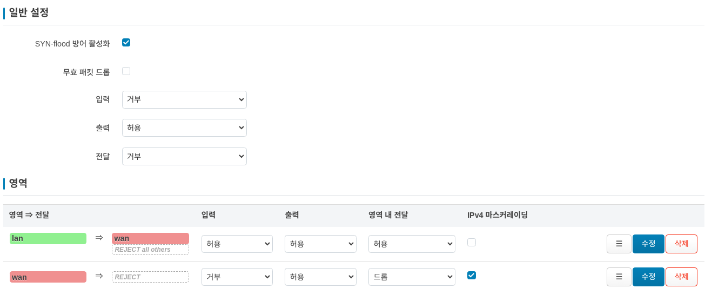

방화벽은 네트워크 인터페이스를 영역(Zone)으로 묶어 네트워크 트래픽 흐름을 제어합니다.

포트 포워딩
------------------------------------
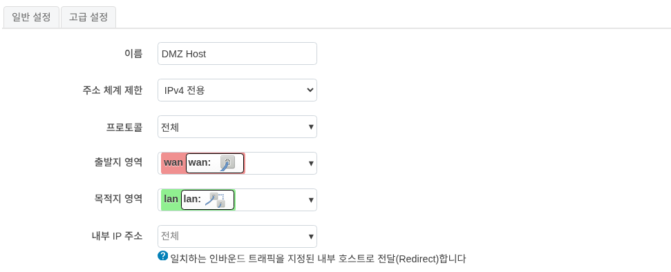

포트 포워딩을 통해 인터넷상의 외부 컴퓨터가 내부 LAN의 특정 컴퓨터나 서비스에 접속할 수 있습니다.

트래픽 규칙
------------------------------------
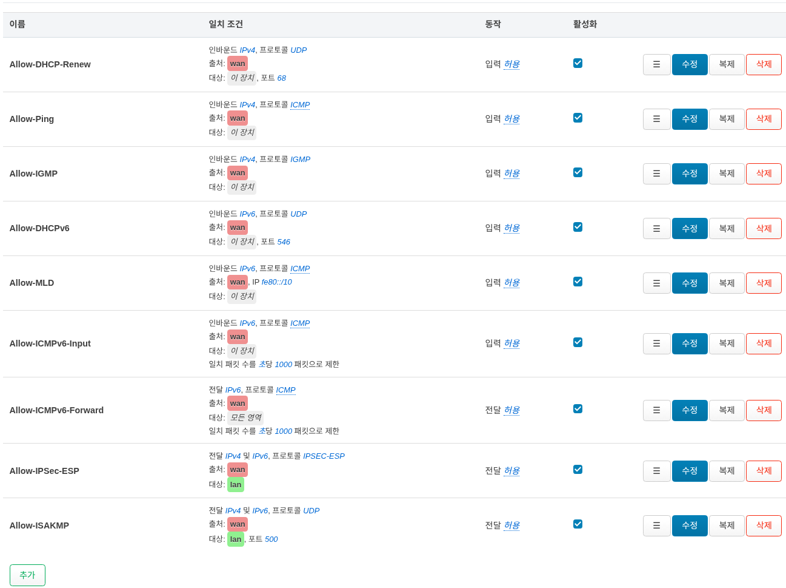

트래픽 규칙은 서로 다른 영역(Zone) 사이를 오가는 패킷에 대한 정책을 정의합니다. 예를 들어 특정 호스트 간의 통신을 차단하거나 라우터의 WAN 포트를 개방할 수 있습니다.

NAT 규칙
------------------------------------
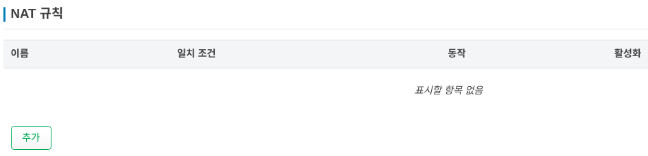

NAT 규칙을 사용하여 외부로 나가거나 전달되는 트래픽의 출발지 IP를 세밀하게 제어할 수 있습니다.

DMZ
------------------------------------
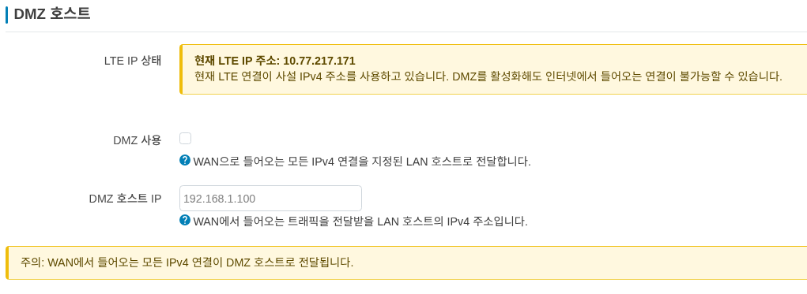
모든 포트를 열고 단일 로컬 장치를 인터넷에 완전히 노출하는 기능 입니다.

CGNAT(Carrier-Grade NAT)구간에서의 사용은, 동작에 제한이 있으며, 만약 WAN ip주소가 해당 대역대로 확인되면 아래와 같은 경고창이 표시 됩니다.

**현재 LTE 연결이 사설 IPv4 주소를 사용하고 있습니다. DMZ를 활성화해도 인터넷에서 들어오는 연결이 불가능할 수 있습니다.**

1. **DMZ 사용** :  만약 사용을 원하면 해당 내용을 체크 합니다.
2. **DMZ 호스트 IP** : 사용을 원하는 디바이스가 있을시에 해당 IP를 설정 합니다.

.. caution:: 
    가능하면 DMZ 대신 표준 포트 포워딩을 사용하여 애플리케이션에 필요한 특정 포트만 여십시오
