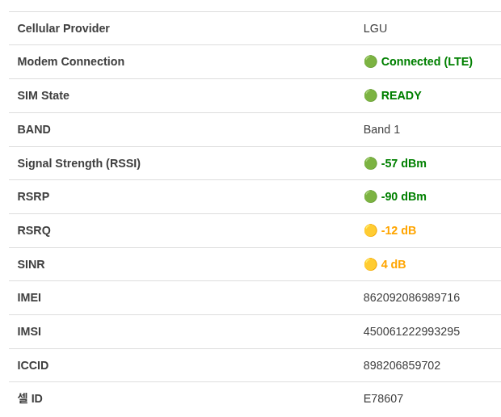
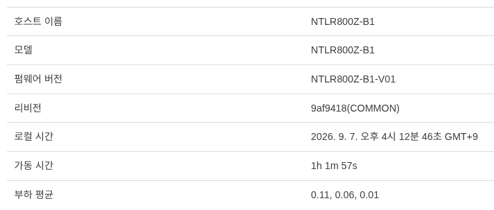
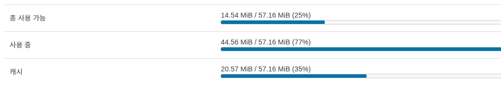
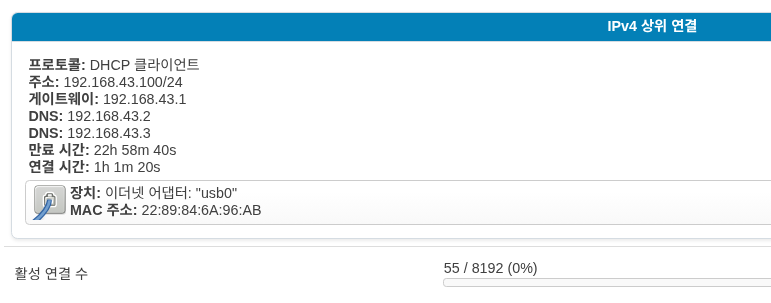
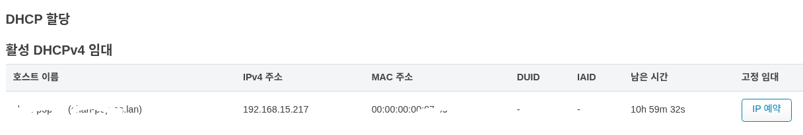
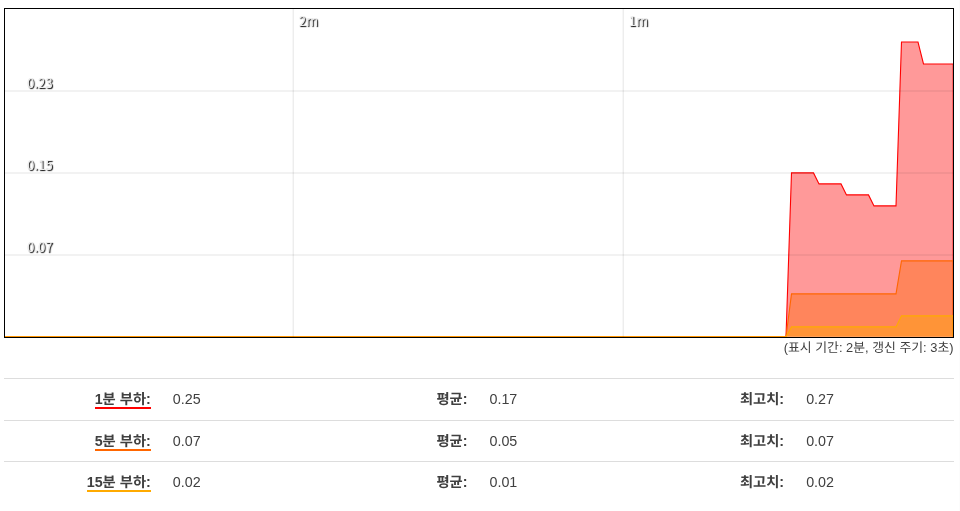
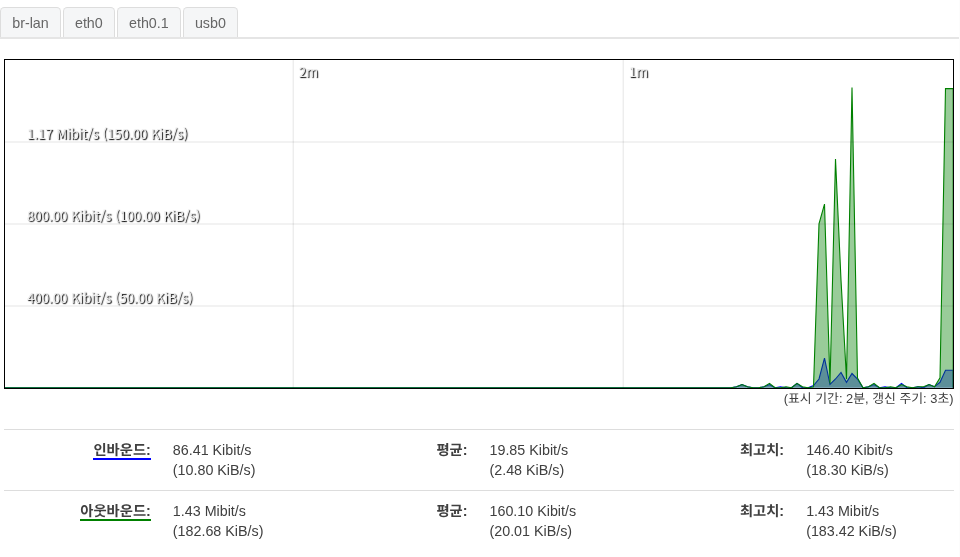
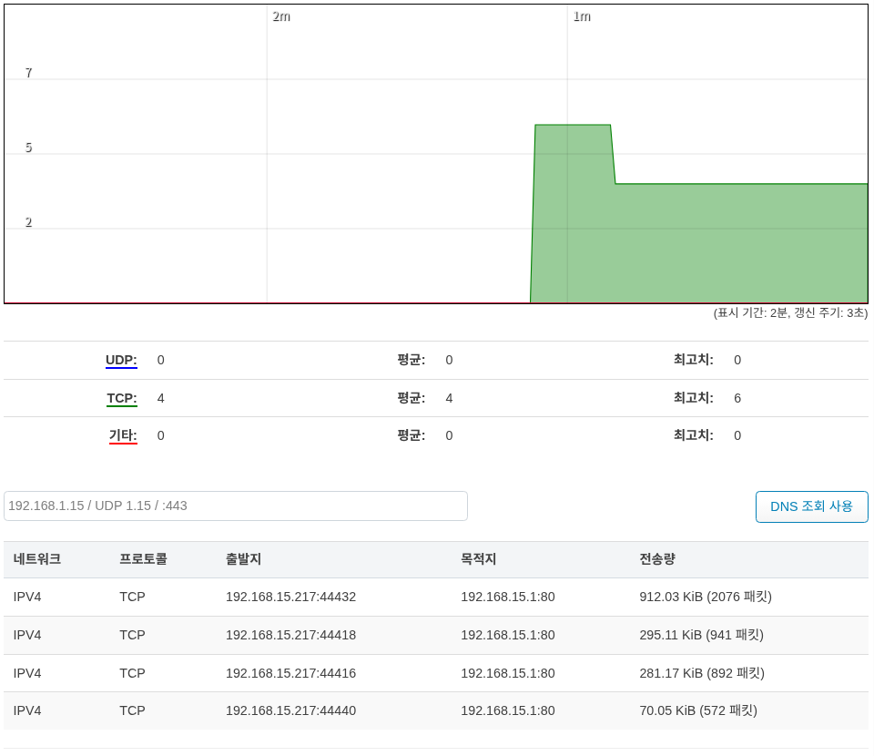

상태
=============

개요
''''''''''''''''''''''''''''

Modem status
------------------------------------

모뎀의 정보를 보여 줍니다. 자세한 항목은 **모뎀** 항목에서 볼수 있습니다.

시스템
------------------------------------

라우터에 대한 정보를 보여줍니다.

메모리
------------------------------------

메모리 사용량을 보여줍니다.

네트워크
------------------------------------

물리적으로 연결된 모뎀의 정보를 보여줍니다.

DHCP 할당
------------------------------------

DHCP 할당에 대한 정보를 보여줍니다. :guilabel:`IP 예약` 을 선택시에 호스트에 대해서 내부 고정 IP 를 설정 합니다.

실시간 그래프
''''''''''''''''''''''''''''
실시간으로 디바이스의 현황을 그래프로 보여줍니다.

부하
------------------------------------

부하 평균은 Linux에서 시스템 자원 현황을 모니터링하기 위해 사용하는 지표입니다.

대역폭
------------------------------------

사용 가능한 모든 물리적 인터페이스의 대역폭 사용 현황을 표시합니다.

연결
------------------------------------

이 장치를 통해 활성화된 연결 현황을 표시합니다. :guilabel:`DNS 조회 사용` 버튼을 클릭하면 목적지까지의 전송량을 표시해 줍니다.