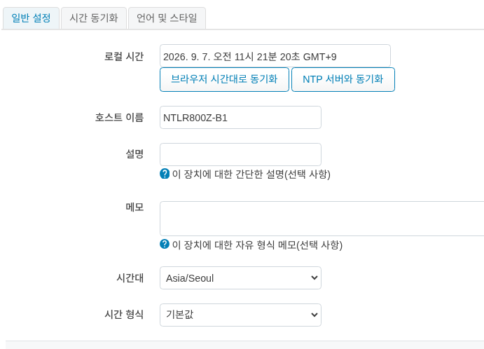
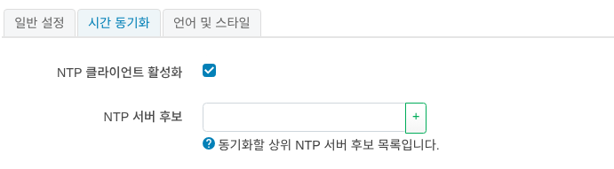
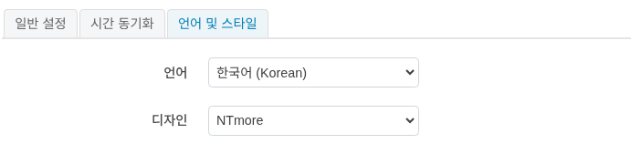
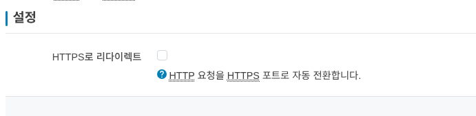

시스템
=============

''''''''''''''''''''''''''''
일반 설정
------------------------------------

1. **로컬 시간** : 현재 디바이스의 시간을 확인할 수 있습니다.

:guilabel:`브라우저 시간대로 동기화`: 현재 사용중인 환경에 브라우저의 시간에 맞춥니다.

:guilabel:`NTP 서버와 동기화` : 시간 동기화 메뉴에 설정된 NTP 서버와 동기화 합니다.

2. **호스트 이름**: 라우터 디바이스의 호스트명을 정할수 있습니다.

3. **설명**: 디바이스에 대한 설명을 입력할 수 있습니다.(선택사항)

4. **메모**: 디바이스에 대한 메모를 입력할 수 있습니다.(선택사항)

5. **시간대**: 디바이스의 시간대를 설정할 수 있습니다.

6. **시간 형식**: 디바이스의 시간 형식을 설정할 수 있습니다. 12시간제와 24시간제를 지원합니다.

시간 동기화
------------------------------------

NTP에 관련한 설정을 할 수 있습니다.

NTP 서버 후보에 NTP 서버 주소를 입력하고, :guilabel:`저장 및 적용` 버튼을 클릭하면 NTP 서버와 동기화가 수행됩니다.

언어 및 스타일
------------------------------------

언어와 스타일을 설정 합니다. 언어는 **한국어** 와 **영어** 를 지원하며, 스타일은 **NTmore** 기본 theme를 제공합니다.

관리
''''''''''''''''''''''''''''

라우터 암호
------------------------------------
.. image:: ./images/password-00.png
    :width: 80%
디바이스의 패스워드를 변경 합니다. 

HTTP(S) 접속
------------------------------------

관리화면 접속시 HTTP 접속을 HTTPS 접속으로 리디이렉션 합니다.

시스템 업데이트
''''''''''''''''''''''''''''
디바이스에 대한 업데이트 설정을 확인하고, 새로운 펌웨어가 있는 경우 업데이트를 수행할 수 있습니다.

정보
------------------------------------
.. image:: ./images/fota-00.png
    :width: 80%

1. **기기 모델** 
2. **디바이스 일련번호** 
3. **현재 펌웨어 버전** : 현재 펌웨어 버전을 확인할 수 있습니다. (revision/build date) 형식으로 구성 되어 있습니다.
4. **FOTA 연동상태** : 현재 FOTA 서버와의 연동 상태를 확인할 수 있습니다. 

:guilabel:`재부팅 실행` 버튼을 클릭하면 FOTA 서버와의 연동 상태를 확인할 수 있습니다.

:guilabel:`즉시 확인` 버튼을 클릭하면 FOTA 서버에서 새로운 펌웨어가 있는지 확인할 수 있습니다.'

설정
------------------------------------
.. image:: ./images/fota-01.png
    :width: 80%
1. **FOTA 기능 활성화** : FOTA 펌웨어 업데이트 기능을 사용합니다. 만약 FOTA 기능을 사용하지 않으려면 체크를 해제하세요.
2. **자동 업데이트 설정** : FOTA 서버에서 새로운 펌웨어가 있는 경우 자동으로 업데이트를 수행합니다. 만약 자동 업데이트를 사용하지 않으려면 체크를 해제하세요.

Backup / Restore config
''''''''''''''''''''''''''''
.. image:: ./images/backup-restore-00.png
    :width: 100%

작업
------------------------------------
1. **백업** 

* 현재 설정 파일에 대한 tar 아카이브 다운로드를 원한다면 :guilabel:`아카이브 생성` 버튼을 클릭하세요.

* 백업된 파일은 브라우저를 통해 PC에 다운로드 됩니다.

2. **복원**

* **기본값으로 초기화**  
   - 설정 파일을 초기 상태로 되돌리려면 ``초기화 수행`` 을 클릭하세요.
   - 초기화 수행후에는 시스템이 재부팅 됩니다.

* **백업 복원** 
   - 설정 파일을 복원하려면 이전에 생성한 백업 아카이브를 :guilabel:`아카이브 업로드` 에 업로드 하세요.
   - 재부팅후에는 시스템이 재부팅 됩니다.

재부팅
''''''''''''''''''''''''''''
.. image:: ./images/reboot-00.png
    :width: 100%
디바이스를 재시작 합니다. :guilabel:`재부팅 실행` 버튼을 클릭하면 시스템이 재부팅 됩니다.
