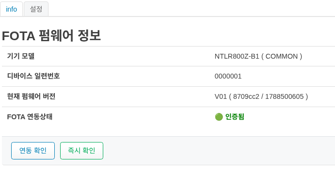
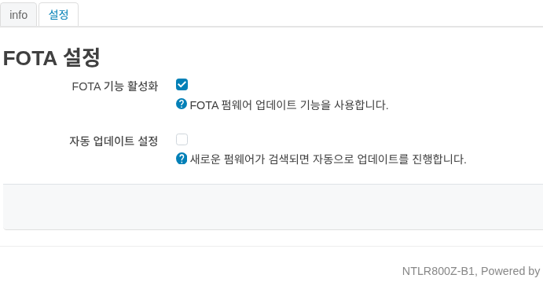
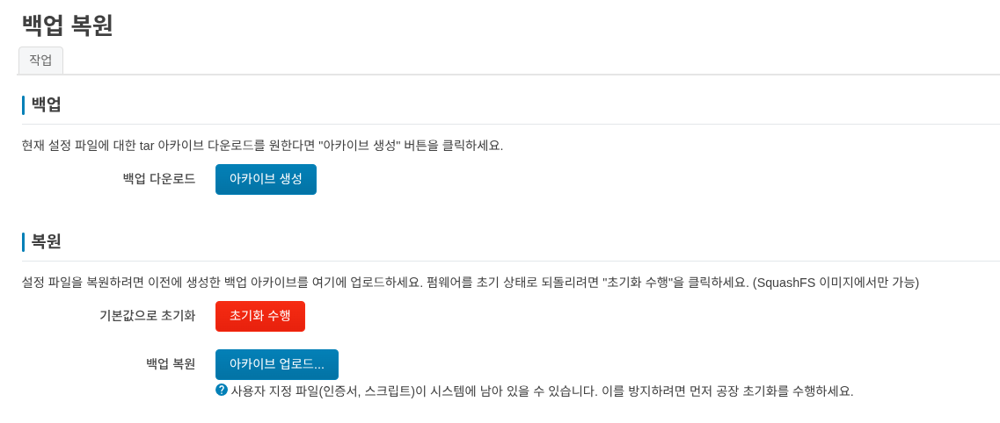

시스템
=============

시스템
''''''''''''''''''''''''''''
일반 설정
------------------------------------

시간 동기화
------------------------------------

언어 및 스타일
------------------------------------

관리
''''''''''''''''''''''''''''

라우터 암호
------------------------------------

HTTP(S) 접속
------------------------------------

시스템 업데이트
''''''''''''''''''''''''''''
디바이스에 대한 업데이트 설정을 확인하고, 새로운 펌웨어가 있는 경우 업데이트를 수행할 수 있습니다.

정보
------------------------------------

1. **기기 모델** 
2. **디바이스 일련번호** 
3. **현재 펌웨어 버전** : 현재 펌웨어 버전을 확인할 수 있습니다. (revision/build date) 형식으로 구성 되어 있습니다.
4. **FOTA 연동상태** : 현재 FOTA 서버와의 연동 상태를 확인할 수 있습니다. 

:guilabel:`재부팅 실행` 버튼을 클릭하면 FOTA 서버와의 연동 상태를 확인할 수 있습니다.

:guilabel:`즉시 확인` 버튼을 클릭하면 FOTA 서버에서 새로운 펌웨어가 있는지 확인할 수 있습니다.'

설정
------------------------------------

1. **FOTA 기능 활성화** : FOTA 펌웨어 업데이트 기능을 사용합니다. 만약 FOTA 기능을 사용하지 않으려면 체크를 해제하세요.
2. **자동 업데이트 설정** : FOTA 서버에서 새로운 펌웨어가 있는 경우 자동으로 업데이트를 수행합니다. 만약 자동 업데이트를 사용하지 않으려면 체크를 해제하세요.

Backup / Restore config
''''''''''''''''''''''''''''

작업
------------------------------------
1. **백업** : 
   - 현재 설정 파일에 대한 tar 아카이브 다운로드를 원한다면 "아카이브 생성" 버튼을 클릭하세요.
   - 백업된 파일은 브라우저를 통해 PC에 다운로드 됩니다.

2. **복원** : 

* **기본값으로 초기화** : 
   - 설정 파일을 초기 상태로 되돌리려면 "초기화 수행"을 클릭하세요.
   - 초기화 수행후에는 시스템이 재부팅 됩니다.

* **백업 복원** : 
   - 설정 파일을 복원하려면 이전에 생성한 백업 아카이브를 여기에 업로드하세요.
   - 재부팅후에는 시스템이 재부팅 됩니다.

재부팅
''''''''''''''''''''''''''''

디바이스를 재시작 합니다. :guilabel:`재부팅 실행` 버튼을 클릭하면 시스템이 재부팅 됩니다.